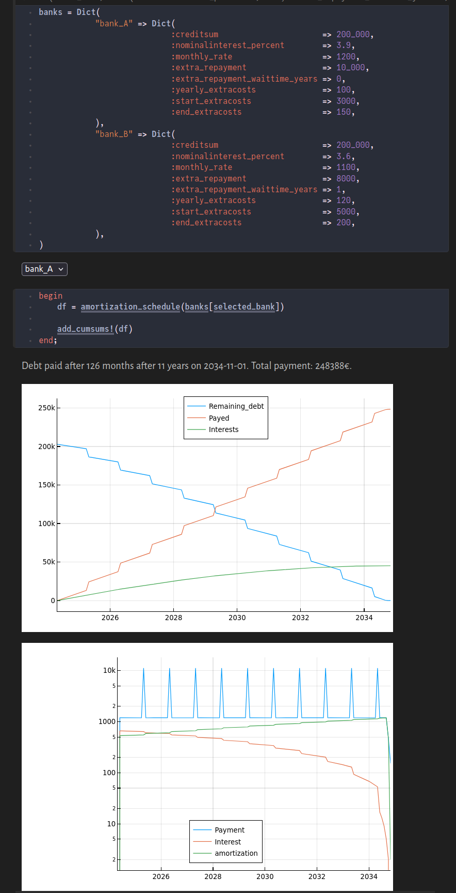

# Amortization Calculator
Create a visualization of your personal credit plan and evaluate various offers. Exercise caution when using this tool. Please note that I am not a financial advisor, and the code has not been extensively tested.



## Using
### Variant 1
#### Instantiating the project

Open julia v`1.10` inside this folder, then

```
# use ']' to open the Pkg REPL
pkg>activate .  
pkg>instantiate
# exit with backspace or CTRL+C
```

#### Notebooks
```
using Pluto
Pluto.run()
```

This opens a browser window where you can open the interactive Pluto notebook `credit.jl`.

#### Variant 2
Follow the instructions in [credit.html](credit.html).